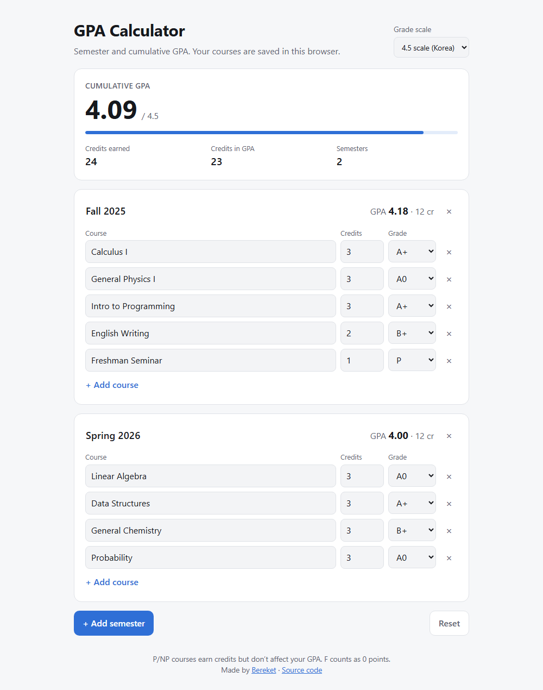

# GPA Calculator

**Live demo: [berekety1.github.io/GPA-Calculator-V2](https://berekety1.github.io/GPA-Calculator-V2/)**

Work out your semester and cumulative GPA in the browser. You can add as many semesters and courses as you like, and the numbers update as you type.

<picture>
  <source media="(prefers-color-scheme: dark)" srcset="docs/screenshot-dark.png">
  
</picture>

## Features

- **Semester and cumulative GPA**, weighted by credits
- **Three grade scales**: 4.5 (used by Korean universities: A+, A0, B+ …), 4.3 and 4.0 (US)
- **Pass/fail courses**: P earns credits without affecting the GPA, and NP earns nothing
- **Saved automatically** in your browser, so your courses are still there next time
- Works on phones and follows your system's light/dark theme

## How the GPA is calculated

```
GPA = Σ (credits × grade points) / Σ credits of graded courses
```

- **F** counts as 0 points, so it lowers your GPA, and it earns no credits.
- **P/NP** courses are left out of the GPA.
- The cumulative GPA is weighted by every course's credits, not averaged across semesters. A light semester counts less than a heavy one.

Switching the grade scale keeps every grade that exists on both scales. Grades the new scale doesn't have (for example A0 on the US scale) show as "–" and are left out until you switch back.

## Run it locally

```bash
npm install
npm run dev     # development server
npm test        # unit tests for the GPA logic (Node's built-in test runner)
npm run build   # production build in dist/
```

Every push to `main` runs the tests, builds the site and deploys it to GitHub Pages ([workflow](.github/workflows/deploy.yml)).

## Project structure

```
src/gpa.js         grade scales and GPA maths (pure functions)
src/gpa.test.js    tests for the maths
src/App.jsx        page layout, cumulative summary, saving to localStorage
src/Semester.jsx   one semester: its courses and semester GPA
src/model.js       creating new semesters and courses
```

## History

This is the second version of my GPA calculator. The [first one](https://github.com/Berekety1/GPA_calculator) was a Python terminal program I wrote in 2022, after we returned to school following COVID-19 and everyone was worried about their grades. This version moves it to the web with React.
